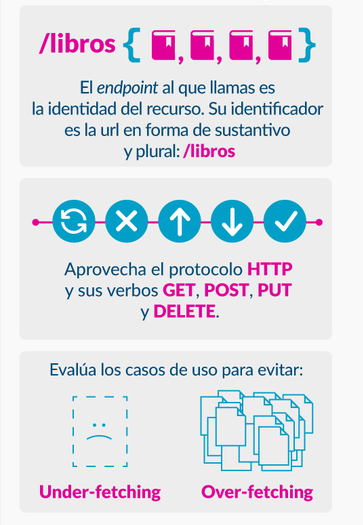

# API Rest - GO

una rest API no es más que un servidor que responde datos en formato json

## Instalar dependencias del Proyecto
```bash
go get -u github.com/gorilla/mux
go get github.com/githubnemo/CompileDaemon
```

## Ejecutar Proyecto
```bash
go build main.go
go run main.go

CompileDaemon -command="programa.exe"
```


## {REST}  (Representational State Transfer)

Es un estilo de **arquitectura para servicios web** creado en el año 2000 por Roy Fielding


